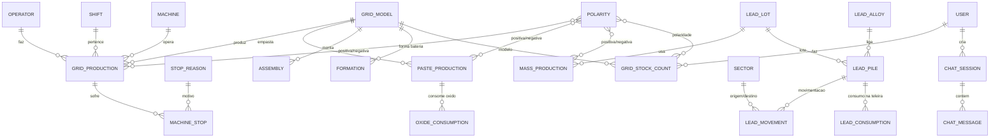
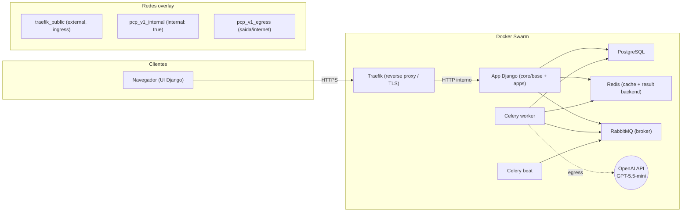
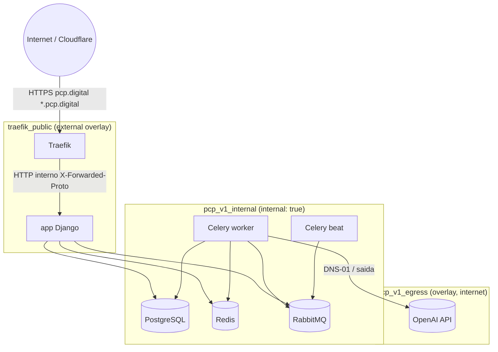
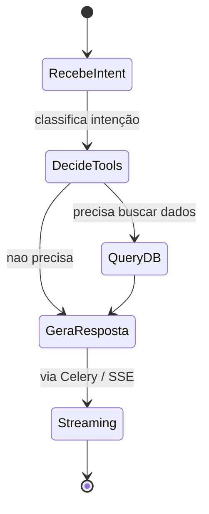

# PRD — Sistema de Gestão, Planejamento e Controle de Produção (PCP Komotors)

**Documento:** Product Requirement Document (PRD)
**Projeto:** PCP Komotors — Sistema de gestão, planejamento e controle de produção
**Domínio:** Fabricação de baterias de chumbo-ácido para motocicletas
**Versão:** 1.0.0
**Data:** 08/07/2026
**Idioma do documento:** Português brasileiro (pt-BR)
**Timezone:** America/Sao_Paulo

---

## 1. Resumo do projeto e glossário

### 1.1 Resumo

O PCP Komotors é um sistema web desenvolvido em Python/Django com o objetivo de digitalizar e centralizar todo o planejamento, controle e gestão da produção de uma fábrica de baterias de chumbo-ácido para motocicletas. O sistema cobre o chão de fábrica — apontamentos de produção das teleiras (fundidora de grade), empaste, masseira, montagem e formação —, o controle de estoque e movimentação de chumbo, o controle de estoque de grades com conferência por contagem física, dashboards, relatórios em PDF, e um agente de Inteligência Artificial (LangChain + LangGraph, GPT-5.5-mini via OpenAI) integrado em diversas partes do sistema, com capacidade de resumir, gerar análises e responder em chat com streaming e renderização markdown.

A aplicação é containerizada com Docker, executada localmente via Docker Compose e deployada em uma VPS Ubuntu usando Docker Swarm, com Traefik como reverse proxy/load balancer e emissão automática de certificado TLS wildcard via Let's Encrypt (challenge DNS-01 com provider Cloudflare). Tasks pesadas (processamento do agente de IA, geração de relatórios, etc.) rodam em segundo plano com Celery + RabbitMQ (broker) + Redis (result backend e cache).

### 1.2 Glossário de termos de domínio

| Termo | Descrição |
|---|---|
| **Grade** | Estrutura de chumbo produzida nas teleiras (fundidora de grade) que receberá a massa ativa para formar o painel. |
| **Painel** | Grade após aplicação da massa ativa na empastadeira. Conjunto de placas formadas a partir da grade empastada. |
| **Placa** | Cada uma das lâminas que compõem a bateria. Normalmente 4 placas por grade (2 pólos + 2 pontas/orelhas). |
| **Ponta / Orelha** | Parte residual da grade que vai para descarte. Cada grade possui normalmente 2 pontas/orelhas. |
| **Teleira** | Sinônimo de fundidora de grade. Máquina que produz a grade a partir do chumbo fundido. Atualmente 3 teleiras (4ª em implantação). |
| **Empastadeira** | Máquina única que aplica a massa ativa sobre a grade vinda da teleira, gerando o painel. |
| **Masseira** | Equipamento que produz a massa ativa consumida pela empastadeira. |
| **Empaste** | Processo de aplicação da massa ativa na grade. |
| **Polaridade** | Positiva ou negativa. Grade, painel e placa são separados por polaridade. |
| **Lote da grade** | Sequencial numérico de 3 dígitos (001 a 999, reinicia em 001). Controle interno, sem rastreabilidade. |
| **Lote do empaste** | Automático a partir da data: `EP{DDMMYYYY}`. Ex.: empaste em 10/07/2026 → `EP10072026`. |
| **Lote do painel/placa** | Usa o lote do empaste correspondente. |
| **Liga** | Tipo de liga de chumbo: **Liga 6** (positiva, amarelo), **Liga 5** (negativa, vermelho), **Liga 0** (chumbo puro, preto/sem cor, para óxido e misc), **Liga 4** (chumbo+estanho Sn, verde). |
| **Monte / Pilha** | Aglomerado de barras de chumbo (quantidade variável, geralmente 50 para fornecedor interno e 35 para fornecedor externo). |
| **Barra de chumbo** | Unidade de chumbo, peso aproximado de 26kg (não é regra). |
| **Setores** | Teleiras (fundidora de grade), Boleira, Moinho, masseira, empastadeira, montagem, formação. |
| **Modelo de bateria** | TX4L (KS), TX5L (ES), TX6L (6Ah), TX7L (TH), B7B (NX), B5L (XTZ). B5L e B7B usam a mesma grade. |
| **Placas por bateria** | Padrão: 24 placas negativas + 18 placas positivas. Exceção B7B: 30 negativas + 24 positivas. |
| **Almoxarifado** | Local de armazenamento do chumbo no estoque. |
| **Óxido** |material derivado do chumbo puro (Liga 0), consumido no empaste. |

---

## 2. Objetivos e escopo

### 2.1 Objetivos

- Substituir as planilhas manuais (Excel/Dropbox) atuais por um sistema web de apontamento de produção em tempo real, com rastreabilidade por usuário, data, setor, máquina, turno e lote.
- Centralizar o controle de estoque de chumbo (entradas, reservas, movimentações ao setor, parciais, vendas diretas, ajustes) e de grades (apontamento + contagem física para conferência).
- Prover dashboards, relatórios em PDF e análises automáticas para apoiar a tomada de decisão do PCP.
- Integrar um agente de IA capaz de resumir dados, gerar análises e responder via chat com acesso à base de dados e streaming markdown.
- Operar em produção com alta disponibilidade, deploy automatizado via Docker Swarm, certificados TLS automáticos e estratégia de backup/restore.

### 2.2 Escopo (dentro)

- Gestão de usuários, autenticação e permissões (auth nativa do Django).
- Apontamentos de produção: teleiras, parada de máquina, empaste, masseira, montagem, formação.
- Controle de estoque de chumbo (entradas, reservas, movimentações, ajustes, vendas diretas).
- Contagem e conferência de estoque de grades por data com visualização dia a dia.
- Dashboard com métricas gerais e por setor.
- Admin do Django com gestão e filtros de todas as entidades.
- Agente de IA (resumir, criar análises e chat) com tools de acesso ao banco.
- Relatórios em PDF (Reportlab + PyPDF).
- Carga inicial de dados fakes para demonstrações (Django command).
- Documentação veiculada via MKDocs com Mermaid.
- Deploy em Docker Swarm (Traefik + TLS wildcard + Cloudflare DNS-01).
- Script de deploy (`scripts/deploy.sh`) e script de backup (`scripts/backup.sh`).

### 2.3 Fora de escopo

- Testes automatizados (não implementar).
- Gestão de fornecedores como entidade de negócio (fornecedor é apenas informativo no controle de chumbo).
- Integração ERP externa (mantida apenas via planilha do Dropbox para formação, se aplicável).
- App mobile nativo (a UI é responsiva web).

---

## 3. Requisitos funcionais

> Regras de idioma: **código-fonte / identificadores / nomes de tabelas e colunas no banco em inglês**; **toda a UI (labels, abas, blocos de preenchimento, mensagens, relatórios) em pt-BR**. Os rótulos da UI traduzem fielmente o domínio: "data", "setor", "modelo", "turno", "operador", "máquina", "polaridade", "lote", "liga", "monte", "peso", "quantidade", etc.

### 3.1 Subsistema de usuários e autenticação

- **RF-U01** Gestão e cadastro de usuários, autenticação e permissões usando a auth nativa do Django.
- **RF-U02** Login por **email** ao invés de username.
- **RF-U03** Cadastro de operadores como entidade de domínio ligada a um usuário quando aplicável (apontamento futuro de consumo de chumbo por operadores).
- **RF-U04** Papéis mínimos: admin (criador) e operador (futuro). Permissões por model via sistema de permissões nativo do Django.

### 3.2 Subsistema de cadastros-base

- **RF-C01** Cadastro de **operadores** (nome, matrícula opcional, ativo).
- **RF-C02** Cadastro de **turnos** (nome, hora início, hora fim).
- **RF-C03** Cadastro de **modelos de grade/bateria** (nome, nome comum, placas positivas, placas negativas, grade compartilhada com outro modelo, ativo).
- **RF-C04** Cadastro de **polaridade** (positiva/negativa) — representada como choices ou entidade leve.
- **RF-C05** Cadastro de **máquinas / teleiras** (nome/numero, setor, ativo).
- **RF-C06** Cadastro de **setores** (teleiras, Boleira, Moinho, masseira, empastadeira, montagem, formação) — fixos e/ou editáveis.
- **RF-C07** Cadastro de **ligas de chumbo** (Liga 0, 4, 5, 6) com cor associada.
- **RF-C08** Cadastro de **motivos de parada de máquina** (categorizados).

### 3.3 Subsistema de apontamentos de produção

#### 3.3.1 Teleiras (fundidora de grade)

- **RF-T01** Cadastro de produção de grade com campos: **data, operador, máquina, turno, modelo, polaridade, lote de produção, quantidade, hora início, hora fim**.
- **RF-T02** Lote de produção de grade: 3 dígitos numéricos (001 a 999), reinicia em 001 ao chegar em 999. Controle interno.
- **RF-T03** Filtros por data, operador, máquina, turno, modelo, polaridade, lote.
- **RF-T04** Cálculo de média de produção por hora (produção / horas trabalhadas) considerando paradas.

#### 3.3.2 Parada de máquina das teleiras

- **RF-P01** Localizar o registro de produção por data, operador e máquina, então registrar parada: **hora que parou, hora que voltou, motivo(s)**.
- **RF-P02** Múltiplos motivos por parada.
- **RF-P03** Impacto automático na média de produção por hora.
- **RF-P04** Listagem e relatório de paradas com filtros.

#### 3.3.3 Empaste (empastadeira)

- **RF-E01** Cadastro de empaste com campos: **data, modelo, polaridade, lote (automático `EP{DDMMYYYY}`), quantidade empastada, perda em painel, perda de grade**.
- **RF-E02** Lote gerado automaticamente a partir da data; informado ao usuário (não editável manualmente).
- **RF-E03** Cadastro de **consumo de óxido pelo empaste** (peso consumido por empaste, quando aplicável).
- **RF-E04** Filtros por data, modelo, polaridade e lote.

#### 3.3.4 Masseira

- **RF-M01** Cadastro de masseira com campos: **data, lote do chumbo, peso, polaridade, peso descartado, peso sobra de massa, peso excesso de óxido, peso excesso de massa pronta, peso do aditivo**.

#### 3.3.5 Montagem

- **RF-MO01** Cadastro de montagem com campos: **data, modelo, lote, quantidade, EP positiva, EP negativa, observação**.

#### 3.3.6 Formação

- **RF-F01** Cadastro de formação com campos: **data, número da mesa, lote da bateria, modelo da bateria, quantidade**.
- **RF-F02** Integração para puxar dados da planilha existente no Dropbox (alimentada pelo pessoal de produção), importando/tracionando os registros para dentro do sistema.

### 3.4 Subsistema de controle de estoque de chumbo

> Este subsistema é **CRÍTICO**. Modelagem detalhada na seção 5.

- **RF-CH01** Cadastro de **entrada de chumbo no estoque** — registre a chegada de uma pilha/monte com: liga, lote, quantidade de barras, peso total (cada barra ~26kg, peso variável), fornecedor (informativo: interno/externo → 50 ou 35 barras por padrão), data de entrada, posição de armazenamento (estrutura 2D).
- **RF-CH02** **Estrutura 2D de identificação da ordem de armazenamento** — cada monte recebe uma posição (ex.: linha/coluna ou almoxarifado + sequência) que o liberador consulta para liberar o monte correto mesmo sem estar no local físico.
- **RF-CH03** **Movimentação** — ao escolher liga + lote, selecione um ou mais **montes clicando neles**. Após selecionar, exiba as opções:
  - **reservar** — selecione o setor de destino; o monte permanece no estoque, mas reservado para aquele setor.
  - **mover ao setor** — o monte sai do estoque para o setor e fica disponível para consumo.
  - **mover ao setor parcial** — apenas parte do monte (algumas barras) é movida; o restante permanece reservado e pode sofrer alterações.
  - **cancelar reserva** — cancela a reserva ativa.
  - **venda direta** — saída para um local fora dos setores cadastrados.
  - **ajuste** — corrige erro de digitação (peso, qtd de barras, etc.).
- **RF-CH04** **Cadastro de consumo de chumbo na teleira** — apontamento do consumo real no setor.
- **RF-CH05** **Página de estoque**: resumo geral na **aba da liga selecionada**, mostrando:
  - Total de **peso** e **barras** no estoque;
  - Total **reservado**;
  - Total **no setor**.
  Em seguida, **cards por lote** mostrando as mesmas informações para cada lote de chumbo individual.
- **RF-CH06** Rastreabilidade por monte: cada monte exibe liga, lote, peso, qtd de barras, status (em estoque, reservado, no setor, parcial, movido, vendido), histórico de movimentações.
- **RF-CH07** Permissões: o liberador (admin) pode operar tudo; o operador (futuro) faz apenas apontamento de consumo do seu setor.

### 3.5 Subsistema de contagem/conferência de estoque de grades

- **RF-G01** Selecionar uma **data de contagem** (dia em que a contagem física foi feita).
- **RF-G02** Marcar dias subsequentes em sequência; à medida que apontamentos de produção de grade são registrados, mostrar a **soma acumulada por modelo e polaridade**.
- **RF-G03** Ao final do empaste, registrar a **contagem das grades que sobraram**; o sistema calcula `quantidade real empastada = quantidade inicial − quantidade que sobrou`.
- **RF-G04** Comparação automática entre a quantidade real empastada (contagem) e a **produção anotada** (apontamento do empaste), exibindo divergências e ajudando a localizar a origem do erro (minha contagem vs. marcação de produção vs. anotação do operador).
- **RF-G05** **Visualização dia a dia** para acompanhar tudo em tempo real, facilitando análises e conferência de estoque.

### 3.6 Subsistema de dashboard e relatórios

- **RF-D01** Dashboard completo com visão geral: produção por setor, por modelo/polaridade, por período; paradas e disponibilidade de máquinas; consumo de chumbo; saldo de estoque de chumbo e de grades.
- **RF-D02** Filtros por período (dia/semana/mês), setor, máquina, modelo, polaridade e operador.
- **RF-D03** Métricas de média de produção por hora nas teleiras (líquido de paradas).
- **RF-D04** Relatórios em PDF (Reportlab + PyPDF): produção de grade, paradas, empaste, masseira, montagem, formação, movimentações de chumbo, conferência de estoque de grades.
- **RF-D05** Exportação/PDF acessível por listagem e por dashboard com filtros aplicados.

### 3.7 Subsistema de admin

- **RF-A01** Django admin com registro de todas as entidades do sistema.
- **RF-A02** Filtros (list_filter), busca (search_fields) e listas (list_display) configurados por entidade.
- **RF-A03** dj-celery-panel para visualização das tasks do Celery no admin.

### 3.8 Subsistema de IA

- **RF-IA01** Agente de IA integrado em diversas partes do sistema com recursos **resumir** e **criar análises**.
- **RF-IA02** Botão e/ou caixa de texto que dispara o agente de IA com **tools de acesso ao banco** para buscar todos os registros relacionados e gerar um resumo/análise.
- **RF-IA03** Tela de **Chat com o agente de IA** acessível pelo menu lateral:
  - Usuário cria **sessões de chat** salvas por usuário.
  - Agente tem tools de acesso a **toda a base de dados com escopo na base do usuário**.
  - Responde com base nesses dados.
  - **Resposta em streaming**.
  - **Resposta em markdown renderizada para HTML** via template adaptado.
- **RF-IA04** UX não-bloqueante: ao disparar tasks de IA em segundo plano (resumos/análises), exibir loading no botão e aviso "você será notificado quando ficar pronto"; notificação in-app ao concluir.
- **RF-IA05** OS agentes DEVEM ser construídos com **LangChain + LangGraph** e usar SEMPRE o modelo **GPT-5.5-mini via OpenAI**.
- **RF-IA06** O processamento do agente de IA roda majoritariamente em **Celery** (processamento pesado em segundo plano).

---

## 4. Requisitos não funcionais

| ID | Categoria | Descrição |
|---|---|---|
| RNF-01 | Responsividade | UI responsiva em todos os tamanhos e dimensões de tela. |
| RNF-02 | Segurança | Sem expor dados sensíveis; rotas fechadas; sistema de permissões e filtros; **media/anexos visíveis apenas a usuários com permissão** — nunca expor URLs de anexos a não autorizados. |
| RNF-03 | UI/UX | Excelente UX aderente ao design system (`@design_system/design-system.html`); jornadas fluidas; bom contraste entre elementos/fontes e fundo. |
| RNF-04 | Não-bloqueio | Tasks em segundo plano: loading no botão + aviso de notificação ao concluir; nada bloqueante. |
| RNF-05 | Desempenho | Filtros, telas e processos com ótimo desempenho; nada bloqueante. |
| RNF-06 | Resiliência (Swarm) | restart_policy (on-failure + delay + max_attempts + window) e resource limits (limits + reservations de CPU/memória) em cada serviço. |
| RNF-07 | Zero-downtime app | update_config com order start-first e failure_action rollback. |
| RNF-08 | Subida ordenada | Nenhum serviço em crash-loop por dependência não pronta — garantido por healthchecks + `wait_for_db` + restart_policy delay. |
| RNF-09 | Least-privilege redes | Celery (worker/beat) em pcp_v1_internal + pcp_v1_egress; nunca em traefik_public. |
| RNF-10 | Collectstatic | `collectstatic --clear` no entrypoint do app. |
| RNF-11 | Secrets | Tokens/senhas de produção via Docker Secrets e/ou .env gitignored da VPS — nunca em texto puro em arquivos versionados. |
| RNF-12 | Idioma | Código em inglês; UI/PRD/docs narrativas em pt-BR; termos de domínio exibidos em português. |
| RNF-13 | Timezone | America/Sao_Paulo. |
| RNF-14 | PEP 8 / aspas | Aspas simples em Python; seguir PEP 8. |
| RNF-15 | Sem testes | Não implementar testes automatizados. |

---

## 5. Modelo de domínio (entidades e relacionamentos)

> Nome de model/tabela em inglês. **Labels da UI em pt-BR** (ex.: model `Grid` exibido como "Grade"; campo `production_date` exibido como "data").

### 5.1 Diagrama ER (visão geral)



### 5.2 Entidades-chave (resumo de campos)

- **Operator** — name, registration?, is_active, created_at, updated_at. UI: "Operador".
- **Shift** — name, start_time, end_time, is_active, created_at, updated_at. UI: "Turno".
- **GridModel** — name, common_name, positive_plates, negative_plates, shares_grid_with (FK self?), is_active, created_at, updated_at. UI: "Modelo". Valores: TX4L/TX5L/TX6L/TX7L/B7B/B5L. B5L e B7B compartilham grade.
- **Polarity** — choices: POSITIVE / NEGATIVE. UI: "Polaridade".
- **Machine** — name/number, sector (FK), is_active, created_at, updated_at. UI: "Máquina". Teleira 1..4.
- **Sector** — name (Teleiras, Boleira, Moinho, Masseira, Empastadeira, Montagem, Formação), is_active, created_at, updated_at. UI: "Setor".
- **StopReason** — code, description, category, is_active, created_at, updated_at. UI: "Motivo da parada".
- **GridProduction** — production_date, operator (FK), machine (FK), shift (FK), grid_model (FK), polarity, lot (3 dígitos), quantity, start_time, end_time, created_at, updated_at. UI: "Produção de grade". Campos na UI: data, operador, máquina, turno, modelo, polaridade, lote, quantidade, hora início, hora fim.
- **MachineStop** — grid_production (FK), stop_start, stop_end, reasons (M2M StopReason), note?, created_at, updated_at. UI: "Parada de máquina".
- **PasteProduction** — paste_date, grid_model (FK), polarity, lot (auto `EP{DDMMYYYY}`), pasted_quantity, panel_loss, grid_loss, created_at, updated_at. UI: "Empaste". Campos: data, modelo, polaridade, lote, quantidade empastada, perda em painel, perda de grade.
- **OxideConsumption** — paste_production (FK), weight, created_at, updated_at. UI: "Consumo de óxido".
- **MassProduction** — mass_date, lead_lot (FK), weight, polarity, discarded_weight, mass_remainder_weight, oxide_excess_weight, ready_mass_excess_weight, additive_weight, created_at, updated_at. UI: "Masseira".
- **Assembly** — assembly_date, grid_model (FK), lot, quantity, positive_ep, negative_ep, note, created_at, updated_at. UI: "Montagem".
- **Formation** — formation_date, table_number, battery_lot, grid_model (FK), quantity, created_at, updated_at. UI: "Formação".
- **LeadAlloy** — code (LIGA_0, LIGA_4, LIGA_5, LIGA_6), name, color, is_active, created_at, updated_at. UI: "Liga".
- **LeadLot** — code, supplier? (informativo), entry_date, created_at, updated_at. UI: "Lote do chumbo".
- **LeadPile** (monte/pilha) — lead_alloy (FK), lead_lot (FK), bar_count, total_weight, position_2d (linha/coluna ou sequência), status (IN_STOCK, RESERVED, IN_SECTOR, PARTIAL, MOVED, SOLD, ADJUSTED), sector? (FK, quando reservado/no setor), created_at, updated_at. UI: "Monte"/"Pilha".
- **LeadMovement** — lead_pile (FK), movement_type (RESERVE, MOVE_TO_SECTOR, MOVE_TO_SECTOR_PARTIAL, CANCEL_RESERVE, DIRECT_SALE, ADJUST), from_sector? (FK), to_sector? (FK), bar_count_delta (para parcial), weight_delta, note?, created_at, updated_at. UI: "Movimentação".
- **LeadConsumption** (teleira) — lead_pile? (FK) ou lead_lot/monte, sector (FK, default Teleiras), consumed_weight, consumed_bars, consumption_date, operator? (FK), created_at, updated_at. UI: "Consumo de chumbo na teleira".
- **GridStockCount** — count_date, grid_model (FK), polarity, counted_quantity, recorded_quantity, divergence?, user (FK), created_at, updated_at. UI: "Contagem de estoque". Visualização dia a dia deriva dos apontamentos de `GridProduction`.
- **ChatSession** — user (FK), title, created_at, updated_at. UI: "Sessão de chat".
- **ChatMessage** — chat_session (FK), role (user/assistant), content (markdown), created_at, updated_at. UI: "Mensagem".
- Todo model DEVE ter `created_at` e `updated_at`.

---

## 6. Arquitetura técnica

### 6.1 Visão geral



### 6.2 Apps do Django

- **core** — app principal (settings, urls, asgi/wsgi, healthcheck).
- **base** — recursos compartilhados (mixins, base models, utils, templates base, design system binding).
- Apps de domínio isolados por responsabilidade (ex.: `operators`, `production`, `lead_stock`, `grid_stock`, `reports`, `ai_agent`, `chat`). Cada app com seus models, views (CBV), forms, admin, signals.py (se aplicável).
- Todos os apps na raiz do projeto.

### 6.3 Celery + RabbitMQ + Redis

- Broker: RabbitMQ. Result backend: Redis. Cache: Redis.
- Tasks pesadas: processamento dos agentes de IA, geração de relatórios PDF, importação de formação.
- Monitoramento via dj-celery-panel no admin.
- Entrypoints do celery apenas esperam o banco (`wait_for_db`); **não rodam migrations nem collectstatic**.

### 6.4 Settings

- Um único `settings.py`. Variáveis via `.env` + django-environ.
- `ALLOWED_HOSTS` e `CSRF_TRUSTED_ORIGINS` lidos do `.env` como listas separadas por vírgula.
- `SECURE_PROXY_SSL_HEADER=('HTTP_X_FORWARDED_PROTO','https')` e `SECURE_REDIRECT_EXEMPT` isentando `/health/`.
- `LANGUAGE_CODE='pt-br'`, `TIME_ZONE='America/Sao_Paulo'`, `USE_I18N=True`, `USE_TZ=True`.
- Login por email (backends/auth customizados mínimos).

### 6.5 Documentação

- `docs/` com MKDocs, servido online, com suporte a Mermaid. Sempre atualizado.

---

## 7. Arquitetura de infraestrutura e deploy (Docker Swarm)

### 7.1 Serviços e redes



### 7.2 Regras OBRIGATÓRIAS de redes

| Serviço | Redes |
|---|---|
| app | traefik_public + pcp_v1_internal |
| celery_worker | pcp_v1_internal + pcp_v1_egress |
| celery_beat | pcp_v1_internal + pcp_v1_egress |
| postgresql | pcp_v1_internal APENAS |
| redis | pcp_v1_internal APENAS |
| rabbitmq | pcp_v1_internal APENAS |
| traefik | traefik_public (+ pcp_v1_internal somente se necessário) |

- **NUNCA** colocar celery_worker ou celery_beat em traefik_public.

### 7.3 Volumes nomeados

- postgresql, redis, rabbitmq, media, staticfiles, certificados do Let's Encrypt (acme).

### 7.4 TLS / Traefik / Cloudflare

- Certificado wildcard para `pcp.digital` e `*.scsi.digital` via Let's Encrypt **DNS-01**, provider Cloudflare.
- DNS-01 é OBRIGATÓRIO para wildcard. **Nunca** usar tlschallenge junto com dnschallenge no mesmo resolver.
- Token Cloudflare em Docker Secret `CLOUDFLARE_DNS_API_TOKEN`; Traefik lê via `CF_DNS_API_TOKEN_FILE=/run/secrets/CLOUDFLARE_DNS_API_TOKEN`.
- Traefik confia nos IP ranges do Cloudflare (`forwardedHeaders.trustedIPs`) e redireciona http → https.

### 7.5 Healthchecks

| Serviço | Healthcheck |
|---|---|
| app | HTTP GET /health/ (200, sem DB, sem auth) |
| postgresql | `pg_isready` |
| redis | `redis-cli ping` |
| rabbitmq | `rabbitmq-diagnostics check_port_connectivity` |

- `start_period` adequado por serviço.
- Ordem de subida garantida por healthchecks + entrypoint `wait_for_db`.

### 7.6 Políticas de deploy

- `restart_policy`: condition `on-failure`, com `delay`, `max_attempts`, `window`.
- `resource limits`: limits + reservations de CPU e memória em todos os serviços.
- app `update_config`: `order: start-first`, `failure_action: rollback` (zero-downtime).
- Migrations com advisory lock do PG (uma réplica por vez).
- `collectstatic --clear` no entrypoint do app.

### 7.7 Entrypoints

- **app**: `wait_for_db` → migrations (advisory lock) → `collectstatic --clear` → `guìnicorn`/`runserver`.
- **celery (worker/beat)**: `wait_for_db` apenas → iniciar celery. **Sem migrations, sem collectstatic**.

### 7.8 Registry e deploy

- Imagem publicada em `ghcr.io/komotors/pcp_v1`.
- `docker stack deploy --with-registry-auth`.

---

## 8. Design do agente de IA (LangGraph)

### 8.1 Máquina de estados (LangGraph)



### 8.2 Tools

- Tools de Leitura sobre os models do domínio (apontamentos, estoque de chumbo, contagem de grades, masseira, montagem, formação, paradas).
- Tools de agregação (médias por hora, saldos por liga/lote, divergências de contagem).
- Escopo por usuário/base (permissões): o agente só acessa dados permitidos ao usuário.

### 8.3 Modelo e execução

- LLM: **GPT-5.5-mini** via OpenAI, SEMPRE.
- Orquestração: LangChain + LangGraph.
- Processamento pesado: **Celery** (worker na rede pcp_v1_egress para acesso à OpenAI).
- Funções expostas: **resumir** (resolve um conjunto de registros e retorna markdown) e **criar análises** (cruza dados e retorna markdown).

### 8.4 Chat

- Sessões por usuário (`ChatSession`), persistidas.
- Streaming da resposta (SSE ou equivalente).
- Resposta em markdown → renderizada para HTML via template adaptado no front.

### 8.5 UX

- Botão "Resumir"/"Criar análise": dispara task Celery; botão mostra loading; toast "você será notificado quando ficar pronto".
- Notificação in-app ao concluir (websockets/SSE/polling leve).
- Chat com streaming não-bloqueante.

---

## 9. Diretrizes de UI/UX

### 9.1 Design system

- Toda UI respeita rigorosamente `@design_system/design-system.html` (cores, componentes, tipografia).
- Termos de domínio em português na UI: data, setor, modelo, turno, operador, máquina, polaridade, lote, liga, monte, pilha, peso, quantidade, etc.

### 9.2 Inventário de telas

1. Login (por email).
2. Dashboard (visão geral com filtros).
3. Cadastros-base: operadores, turnos, modelos, polaridades, máquinas, setores, ligas, motivos de parada.
4. Apontamentos:
   - Produção de grade (teleiras) — listagem + formulário.
   - Parada de máquina — listagem + formulário (localizar por data/operador/máquina).
   - Empaste — listagem + formulário (lote automático).
   - Consumo de óxido pelo empaste.
   - Masseira, Montagem, Formação — listagens + formulários.
5. Estoque de chumbo:
   - Visão geral por liga (aba selecionada) com totais (estoque, reservado, no setor).
   - Cards por lote/monte com status e histórico de movimentações.
   - Entrada de chumbo (nova pilha) com posição 2D.
   - Movimentação (reservar / mover ao setor / parcial / cancelar reserva / venda direta / ajuste).
   - Consumo de chumbo na teleira.
6. Contagem de estoque de grades:
   - Seleção de data de contagem, marcação dos dias subsequentes.
   - Visualização dia a dia com somas por modelo/polaridade.
   - Lançamento da contagem física final e divergência calculada.
7. Relatórios: listagem por tipo com filtros + geração de PDF.
8. Chat de IA: lista de sessões + chat com streaming markdown.
9. Notificações in-app.

### 9.3 Jornadas

- Operador/admin registra apontamento → confirma → dashboard atualiza → opcionalmente dispara "resumir"/"análise" (task em background).
- Liberador seleciona liga+ lote → clica em monte(s) → escolhe ação → confirma → status do monte e resumo da liga atualizam.
- Conferência: seleciona data de contagem → acompanha dias → lança contagem física final → vê divergência.

---

## 10. Guia de deploy — VPS Ubuntu (do zero)

> Comandos abaixo; substitua placeholders `<...>` pelos valores reais. Execute como usuário com permissão sudo.

### 10.1 Pré-requisitos na VPS

```bash
ssh root@<IP_VPS>
apt update && apt upgrade -y
apt install -y curl git ufw
ufw allow 22/tcp
ufw allow 80/tcp
ufw allow 443/tcp
ufw --force enable
```

### 10.2 Instalar Docker e inicializar Swarm

```bash
curl -fsSL https://get.docker.com | sh
systemctl enable --now docker
docker swarm init --advertise-addr <IP_VPS>
```

- Verifique: `docker node ls`.

### 10.3 Criar as redes overlay

```bash
docker network create --driver overlay --attachable traefik_public
docker network create --driver overlay --internal pcp_v1_internal
docker network create --driver overlay pcp_v1_egress
docker network ls
```

### 10.4 Token da API do Cloudflare e Docker Secret

1. Em https://dash.cloudflare.com → My Profile → API Tokens → Create Token.
2. Use o template "Edit zone DNS" ou crie personalizado com:
   - Permissions: **Zone > DNS > Edit**.
   - Zone Resources: **Include > Specific zone > pcp.digital**.
3. Copie o token.
4. Crie o Docker Secret:

```bash
echo "<SEU_TOKEN_CLOUDFLARE>" | docker secret create CLOUDFLARE_DNS_API_TOKEN -
docker secret ls
```

> O token **não** deve ir no `.env` versionado nem no compose em texto puro. Apenas via Docker Secret. O Traefik lê via `CF_DNS_API_TOKEN_FILE=/run/secrets/CLOUDFLARE_DNS_API_TOKEN`.

### 10.5 Criar demais secrets de produção

```bash
echo "<POSTGRES_PASSWORD>" | docker secret create POSTGRES_PASSWORD -
echo "<RABBITMQ_PASSWORD>" | docker secret create RABBITMQ_PASSWORD -
echo "<REDIS_PASSWORD>" | docker secret create REDIS_PASSWORD -
echo "<DJANGO_SECRET_KEY>" | docker secret create DJANGO_SECRET_KEY -
echo "<OPENAI_API_KEY>" | docker secret create OPENAI_API_KEY -
docker secret ls
```

> Sempre prefira Docker Secrets para credenciais sensíveis em produção.

### 10.6 Clonar o projeto e preparar o .env de produção

```bash
cd /opt
git clone <REPO_GIT> pcp
cd pcp
git pull
```

Crie o `.env` de produção (separado do `.env` de dev; não versionado):

```bash
cp .env.example .env
```

Edite `/opt/pcp/.env` com:

```env
DEBUG=False
DJANGO_SETTINGS_MODULE=core.settings
SECRET_KEY=/run/secrets/DJANGO_SECRET_KEY
ALLOWED_HOSTS=pcp.digital,.pcp.digital,localhost,127.0.0.1
CSRF_TRUSTED_ORIGINS=https://pcp.digital,https://*.pcp.digital
DATABASE_URL=postgres://postgres:<POSTGRES_PASSWORD>@db:5432/pcp
REDIS_URL=redis://:<REDIS_PASSWORD>@redis:6379/0
CELERY_BROKER_URL=amqp://guest:<RABBITMQ_PASSWORD>@rabbitmq:5672//
OPENAI_API_KEY=/run/secrets/OPENAI_API_KEY
OPENAI_MODEL=gpt-5.5-mini
```

> Os scripts de deploy leem o `.env` com **parser seguro de KEY=VALUE** (nunca `source`/`.`), pois valores com `& $ * @` quebram o shell.

### 10.7 Build, push e deploy

```bash
cd /opt/pcp
bash scripts/deploy.sh
```

`scripts/deploy.sh` deve:
1. Carregar o `.env` com parser seguro (ex.: `awk -F=` ou lib Python `python-dotenv`).
2. Validar pré-condições:
   - Swarm ativo;
   - secret `CLOUDFLARE_DNS_API_TOKEN` existe;
   - redes overlay `traefik_public` e `pcp_v1_egress` existem;
   - `DEBUG=False` e `localhost` em `ALLOWED_HOSTS`.
3. `git pull`.
4. `docker build` + `docker push` para `ghcr.io/komotors/pcp_v1:latest`.
5. `docker stack deploy -c stack.yml pcp_v1 --with-registry-auth`.
6. Forçar rollout de `app`, `celery_worker` e `celery_beat`:

```bash
docker service update --force pcp_v1_app
docker service update --force pcp_v1_celery_worker
docker service update --force pcp_v1_celery_beat
```

Modo sem rebuild:

```bash
bash scripts/deploy.sh --skip-build
```

### 10.8 Verificar emissão do certificado wildcard (DNS-01)

```bash
docker service logs pcp_v1_traefik --tail 200 | grep -i "acme\|certificate\|let's encrypt"
curl -kI https://pcp.digital/health/
curl -kI https://pcp.digital/
```

- Aguarde até ver "Certificate obtained" nos logs do Traefik.
- Confirme `200` em `/health/`.

### 10.9 Healthcheck pós-deploy

```bash
docker stack services pcp_v1
docker service ps pcp_v1_app
docker service ps pcp_v1_db
curl -I https://pcp.digital/health/
```

### 10.10 Login no registry (se criptografado)

```bash
echo "<GITHUB_PAT>" | docker login ghcr.io -u komotors --password-stdin
```

> Use o PAT com permissão de `write:packages` no GHCR.

---

## 11. Estratégia de backup/restore

### 11.1 Backup (`scripts/backup.sh`)

- Rotina via `cron` (diária, por exemplo 02:00).
- Backup do PostgreSQL: `pg_dump` compactado.
- Backup da pasta `media/` (uploads/anexos).
- Rotação por tempo: manter ex.: últimos 7 diários + 4 semanais + 12 mensais (gerenciado por `find` por mtime).
- Destino: volume nomeado `pcp_v1_backups` (ou montagem externa/S3).

```bash
# exemplo lógico
ts=$(date +%Y%m%d_%H%M%S)
docker exec pcp_v1_db pg_dump -U postgres pcp | gzip > /backups/db_${ts}.sql.gz
tar czf /backups/media_${ts}.tar.gz -C /opt/pcp media
find /backups -name "*.gz" -mtime +7 -delete
find /backups -name "*.tar.gz" -mtime +30 -delete
```

### 11.2 Restore

- DB: `gunzip < backup.sql.gz | docker exec -i pcp_v1_db psql -U postgres pcp`.
- Media: `tar xzf media_BACKUP.tar.gz -C /opt/pcp`.

---

## 12. Sprints de implementação

> Marque `X` dentro dos colchetes ao concluir: `- [X]`.

### Sprint 1 — Fundação do projeto

- [X] Criar repositório e `.gitignore` (.venv, .env, __pycache__, media, staticfiles).
- [X] Criar ambiente virtual `.venv` e `requirements.txt` na raiz.
- [X] Instalar Django e dependências base.
- [X] Criar projeto Django (settings único) e app `core`.
- [X] Criar app `base`.
- [X] Configurar `settings.py` com django-environ e `.env`.
- [X] Configurar timezone `America/Sao_Paulo` e idioma `pt-br`.
- [X] Configurar login por email (backend de auth).
- [X] Criar folder `@design_system/` com `design-system.html`.
- [X] Criar templates base aderentes ao design system.

### Sprint 2 — Cadastros-base

- [X] App `operators`: model Operator (UI "Operador"), admin, list/detail/create/update via CBV.
- [X] App de cadastros: Shift ("Turno"), GridModel ("Modelo"), Polarity, Machine ("Máquina"), Sector ("Setor"), LeadAlloy ("Liga"), StopReason ("Motivo da parada").
- [X] Seed inicial de ligas (0, 4, 5, 6) e setores via migration/data migration.
- [X] Admin com list_display, list_filter e search_fields por entidade.
- [X] Garantir `created_at`/`updated_at` em todos os models.

### Sprint 3 — Apontamentos de produção (teleiras)

- [X] Model `GridProduction` com campos da UI: data, operador, máquina, turno, modelo, polaridade, lote, quantidade, hora início, hora fim.
- [X] Lote automático 3 dígitos (001–999, reinicia).
- [X] Views(list/detail/form) CBV + templates aderentes ao design system.
- [X] Filtros por data/operador/máquina/turno/modelo/polaridade/lote.
- [X] Permissões por usuário.

### Sprint 4 — Paradas de máquina

- [ ] Model `MachineStop` + `StopReason` (M2M).
- [ ] Localizar produção por data/operador/máquina antes de registrar parada.
- [ ] Cálculo de média de produção por hora líquido de paradas.
- [ ] Listagem e relatório de paradas com filtros.

### Sprint 5 — Empaste e consumos

- [ ] Model `PasteProduction` (lote auto `EP{DDMMYYYY}`).
- [ ] Model `OxideConsumption`.
- [ ] Validação de lote não editável.
- [ ] Filtros por data/modelo/polaridade/lote.

### Sprint 6 — Masseira, Montagem, Formação

- [ ] Model `MassProduction` com todos os campos de masseira.
- [ ] Model `Assembly`.
- [ ] Model `Formation`.
- [ ] Importação de planilha do Dropbox para Formação (parser seguro).
- [ ] Admin e filtros para cada um.

### Sprint 7 — Estoque de chumbo (entradas e estrutura 2D)

- [ ] Models `LeadAlloy`, `LeadLot`, `LeadPile` com posição 2D.
- [ ] Cadastro de entrada de chumbo (lote, liga, qtd barras, peso, fornecedor informativo).
- [ ] Status do monte (IN_STOCK, RESERVED, IN_SECTOR, PARTIAL, MOVED, SOLD, ADJUSTED).
- [ ] Página de estoque com abas por liga e resumo geral (peso/barras, reservado, no setor).
- [ ] Cards por lote mostrando mesmas informações.

### Sprint 8 — Movimentação de chumbo

- [ ] Model `LeadMovement` (RESERVE, MOVE_TO_SECTOR, MOVE_TO_SECTOR_PARTIAL, CANCEL_RESERVE, DIRECT_SALE, ADJUST).
- [ ] UI: seleção de liga+lote → clicar em monte(s) → exibir opções.
- [ ] Reserva com setor de destino; cancelar reserva.
- [ ] Mover ao setor (total) e mover ao setor parcial (delta de barras).
- [ ] Venda direta e ajuste.
- [ ] Histórico de movimentações por monte.
- [ ] Model `LeadConsumption` (consumo de chumbo na teleira).

### Sprint 9 — Contagem de estoque de grades

- [ ] Model `GridStockCount`.
- [ ] Seleção de data de contagem e marcação dos dias subsequentes.
- [ ] Soma acumulada por modelo/polaridade a partir de `GridProduction`.
- [ ] Lançamento da contagem física final.
- [ ] Cálculo de divergência: `quantidade inicial − quantidade que sobrou` vs. produção anotada.
- [ ] Visualização dia a dia.

### Sprint 10 — Dashboard

- [ ] Dashboard com visão geral e métricas globais.
- [ ] Filtros por período/setor/máquina/modelo/polaridade/operador.
- [ ] Média de produção por hora das teleiras (líquido de paradas).
- [ ] Cards de saldo de chumbo (por liga/lote) e de grades.
- [ ] Aderência total ao design system.

### Sprint 11 — Relatórios (Reportlab + PyPDF)

- [ ] Relatório de produção de grade.
- [ ] Relatório de paradas.
- [ ] Relatório de empaste.
- [ ] Relatório de masseira, montagem e formação.
- [ ] Relatório de movimentações de chumbo.
- [ ] Relatório de conferência de estoque de grades.
- [ ] Exportação por listagem com filtros aplicados.

### Sprint 12 — IA: resumir e criar análises

- [ ] Instalar LangChain + LangGraph.
- [ ] Configurar OpenAI (GPT-5.5-mini) via `.env`/secret.
- [ ] Implementar tools de leitura e agregação sobre os models.
- [ ] Grafo LangGraph (RecebeIntent → DecideTools → QueryDB → GeraResposta → Streaming).
- [ ] Botões "Resumir" e "Criar análise" em listagens/dashboards.
- [ ] Task Celery para processamento pesado.
- [ ] UX: loading no botão + aviso "você será notificado".

### Sprint 13 — Chat de IA

- [ ] Models `ChatSession` e `ChatMessage`.
- [ ] Tela de chat no menu lateral.
- [ ] Sessões por usuário (lista + criar).
- [ ] Streaming de resposta (SSE).
- [ ] Renderização markdown → HTML via template adaptado.
- [ ] Escopo de tools por usuário/base.
- [ ] Notificações in-app.

### Sprint 14 — Infraestrutura Docker

- [ ] `Dockerfile` multi-stage do app.
- [ ] `docker-compose.yml` (dev) com postgres/redis/rabbitmq/celery/traefik.
- [ ] `stack.yml` (prod, Swarm) com serviços, redes (traefik_public/pcp_v1_internal/pcp_v1_egress), volumes, healthchecks, restart_policy, resource limits, update_config do app.
- [ ] Entrypoints: `app` (wait_for_db + advisory lock migrations + collectstatic --clear), `celery` (wait_for_db apenas).
- [ ] Configuração Traefik com DNS-01 Cloudflare via Docker Secret.
- [ ] Healthcheck `/health/` sem DB e sem auth.

### Sprint 15 — Deploy e operação

- [ ] `scripts/deploy.sh` (parser seguro de .env, pré-condições, build, push, stack deploy, rollout; modo `--skip-build`).
- [ ] `scripts/backup.sh` (PostgreSQL + media, rotação por tempo).
- [ ] Login no GHCR e `docker stack deploy --with-registry-auth`.
- [ ] Verificação de certificado wildcard via DNS-01.
- [ ] Teste de zero-downtime update (start-first + rollback).
- [ ] Documentação do deploy em `docs/`.

### Sprint 16 — Documentação e carga de dados

- [ ] Configurar MKDocs com suporte a Mermaid.
- [ ] Documentação de domínio (glossário), arquitetura, deploy, backup.
- [ ] Django command de seed de dados fakes (múltiplos cenários, datas variadas).
- [ ] Rotear `docs/` para serví-la online.
- [ ] Revisão final de aderência ao design system e de termos em pt-BR na UI.

---

## 13. Riscos, premissas, fora de escopo

### 13.1 Riscos

- R-01: Disponibilidade/latência da API OpenAI → mitigação: retries via LangGraph/Celery, timeouts, fallback de mensagem.
- R-02: Divergência de estoque de grades por erro de apontamento → mitigada pelo módulo de contagem e visualização dia a dia.
- R-03: Secrets vazados em arquivos versionados → mitigado por Docker Secrets + `.env` gitignored da VPS.
- R-04: Loop de redirect atrás do Traefik → mitigado por `SECURE_PROXY_SSL_HEADER` + isenção de `/health/`.
- R-05: Conflitos de collectstatic em redeploys → mitigado por `--clear`.
- R-06: Migrations concorrentes em múltiplas réplicas → mitigado por advisory lock do PG.
- R-07: Exposição indevida de media → mitigado por checagem de permissão em views de media/arquivos.

### 13.2 Premissas

- A VPS roda Ubuntu moderno com acesso root/sudo.
- O domínio `pcp.digital` está gerenciado no Cloudflare.
- O GHCR está configurado e o PAT tem `write:packages`.
- A planilha de Formação no Dropbox tem estrutura previsível para importação.

### 13.3 Fora de escopo

- Testes automatizados.
- Cadastro de fornecedores como entidade de negócio.
- APP mobile nativo.
- Integração com ERP externo (além da importação da planilha de Formação).

---

## 14. Changelog do PRD

| Versão | Data | Alterações |
|---|---|---|
| 1.0.0 | 08/07/2026 | Versão inicial do PRD a partir do brief `sistema.md`. |

---

**Fim do documento.**